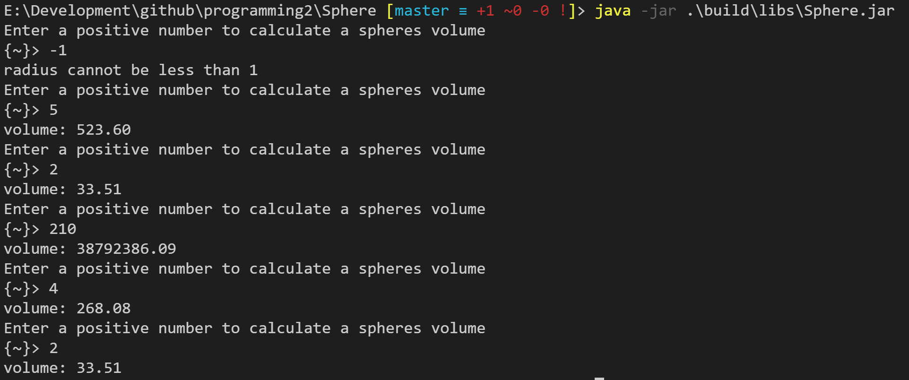

# Sphere

Open a new project in ~~Netbeans~~ Eclipse Project and call it Sphere. Write a complete java program that takes the radius of a sphere as an input from the user and calculates its volume using the formula:

Volume = (4/3) x PI x (Radius)3

Your program should contain the following parts:

1. A class Sphere that contains a Constructor, Set, Get, and sphereVolume methods (25 points)

2. Correct use of the static Math class and methods (10 points)

3. A main function that prompts the user for a positive number and displays the sphere's volume with 2 digits precision. Input validation needs to be performed. Your output should repeat 5 times before the program exits. (15 points)

Upload both your code and a snapshot of the output as a zipped file to this question on Canvas

## Output

## Requirements

- [Java SE](http://www.oracle.com/technetwork/java/javase/overview)
- [Gradle](http://www.gradle.org)

---

Copyright &copy; 2017 Mark Pro.
